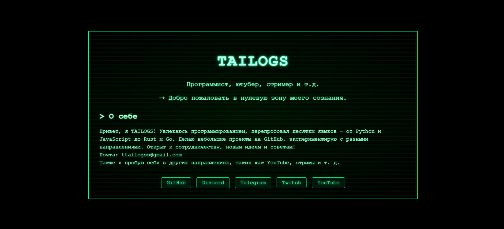

# 🖥️ TAILOGS // CRT

Добро пожаловать в **нулевую зону сознания** — визуальный интерфейс с уникальной атмосферой, где минимализм сочетается с эффектами, пробуждающими внимание.

## 📼 О проекте

Это персональный сайт Tailogs — программиста, ютубера, стримера и просто творческого человека.  
Сайт оформлен в стиле CRT с визуальными эффектами: свечением, дрожанием текста и сканлиниями.

### ✨ Особенности

- 🖋️ Анимация "набирающегося" текста  
- 👁️ Эффект включения экрана  
- 🔦 Сканлинии и свечение  
- 🌐 Ссылки на соцсети  
- 📱 Полная адаптивность  
- 🧠 Максимум читаемости с минимумом цвета  

## 🛠️ Технологии

- HTML5  
- CSS3 (анимации, media queries)  
- Без JavaScript — всё работает нативно  

## 🔗 Социальные ссылки

- [GitHub](https://github.com/tailogs)  
- [Discord](https://discord.gg/ecYxypdR)  
- [Telegram](https://t.me/tailogs_channel)  
- [Twitch](https://www.twitch.tv/tailogs_)  
- [YouTube](https://www.youtube.com/@tailogs5825)  

## 📂 Структура проекта

```

/
├── index.html         # Главная страница
├── style.css          # Стилизация в стиле CRT
├── LICENSE            # Лицензия репозитория
├── image.png          # Фотография сайта
└── README.md          # Этот файл

```

## 📸 Скриншот



## 📫 Контакты

По всем вопросам и предложениям:  
**ttailogss@gmail.com**

---

🧪 _Создано с любовью к визуальному коду. Береги глаза — и добро пожаловать в пространство Tailogs._
